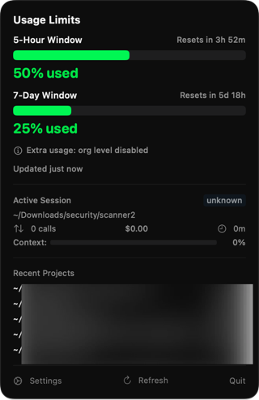

# Claude Code Usage Bar

Claude Code API kullanım limitlerini macOS menu bar'da gerçek zamanlı gösteren native bir SwiftUI uygulaması.


## Ekran Görüntüsü

<p align="center">
  
</p>

## Özellikler

- **Menu Bar Göstergesi**: 5 saatlik kullanım yüzdesi ve aktif session maliyetini menu bar'da gösterir
- **Detaylı Popover**: Tıklandığında 5 saatlik / 7 günlük limit kullanımı, aktif session bilgileri ve proje bazlı maliyet listesi
- **Gerçek Zamanlı İzleme**: FSEvents ile `~/.claude/projects/` dizinini izler, değişiklikleri anında yakalar
- **Incremental JSONL Parse**: Büyük session dosyalarını (100MB+) verimli şekilde parse eder - sadece yeni eklenen satırları okur
- **Rate Limit Bilgisi**: Anthropic API'den dönen header'lardan limit durumunu okur
- **Maliyet Takibi**: Backup dosyalarından proje bazlı maliyet bilgisi çeker

## Kurulum

### Gereksinimler
- macOS 13.0 (Ventura) veya üzeri
- Xcode 15+
- Aktif Claude Code kurulumu (OAuth token Keychain'de kayıtlı olmalı)

### Build

```bash
git clone https://github.com/berkimran/claude-code-usage-bar.git
cd claude-code-usage-bar
open ClaudeMonitor.xcodeproj
```

Xcode'da `Cmd+R` ile çalıştır. Uygulama menu bar'da görünecektir.

## Nasıl Çalışır

1. **Token Okuma**: macOS Keychain'den Claude Code OAuth token'ını okur
2. **API Çağrısı**: Minimal bir API çağrısı yaparak response header'lardan rate limit bilgilerini alır
3. **Session İzleme**: `~/.claude/projects/` altındaki JSONL dosyalarını FSEvents ile izler
4. **Backup Parse**: `~/.claude/backups/` altındaki backup config dosyalarından maliyet bilgisi çeker
5. **Incremental Update**: Dosya değişikliklerinde sadece yeni eklenen byte'ları okur, tüm dosyayı tekrar parse etmez

## Mimari

```
ClaudeMonitor/
├── App/
│   ├── ClaudeMonitorApp.swift    # MenuBarExtra entry point
│   └── AppState.swift            # Merkezi state yönetimi
├── Models/
│   ├── Constants.swift           # Dosya yolları ve sabitler
│   ├── JSONLMessage.swift        # JSONL Codable modeller
│   ├── BackupConfig.swift        # Backup config modelleri
│   ├── SessionUsage.swift        # Session metrik modeli
│   └── RateLimitInfo.swift       # Rate limit modeli
├── Services/
│   ├── SessionWatcher.swift      # FSEvents dosya izleme
│   ├── JSONLParser.swift         # Incremental JSONL parser
│   ├── BackupReader.swift        # Backup config okuyucu
│   └── RateLimitFetcher.swift    # API rate limit sorgulama
└── Views/
    ├── MenuBarLabel.swift        # Menu bar inline görünüm
    ├── PopoverView.swift         # Detay popover penceresi
    ├── ContextBarView.swift      # Kullanım çubuğu komponenti
    ├── TokenBreakdownView.swift  # Token detay tablosu
    └── SettingsView.swift        # Ayarlar penceresi
```

## Ayarlar

- **Menu bar'da maliyet göster**: Açık/Kapalı
- **Güncelleme aralığı**: 30s / 1m / 2m / 5m
- **Renk eşikleri**: Yeşil→Sarı, Sarı→Turuncu, Turuncu→Kırmızı geçiş yüzdeleri
- **Giriş'te başlat**: Login item olarak kayıt

## Notlar

- Uygulama sandbox dışında çalışır (`~/.claude/` dizinine erişim gereklidir)
- Dock'ta görünmez, sadece menu bar'da çalışır (LSUIElement)
- API çağrıları minimum 60 saniye aralıkla yapılır
- Session 5 dakikadan fazla güncellenmediyse "idle" durumuna geçer

## Lisans

MIT
